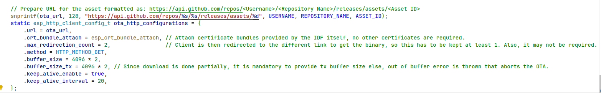
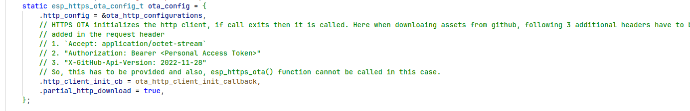
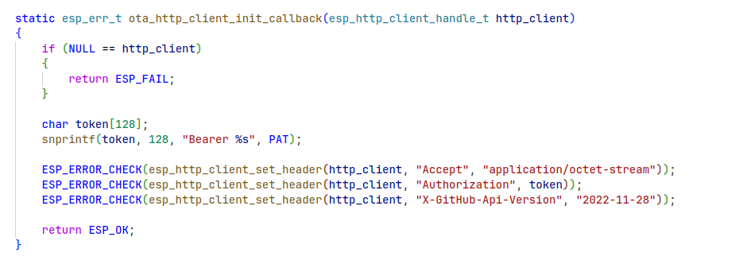
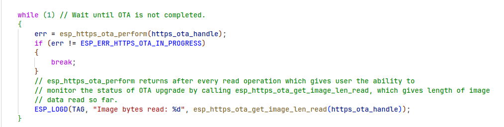

# ESP OTA USING GITHUB

This repository contains firmware that uses binary in github release for OTA updates. Here, the repository is a private one so, personal access token is required. It is not tested on public repository.

### Requirements
1. Private repository that has binary on the release.
2. Personal Access Token with repo read and write permissions
3. Asset id for the release

``` bash
    curl -L \
    -H "Accept: application/vnd.github+json" \
    -H "Authorization: Bearer <Personal Access Token>" \
    -H "X-GitHub-Api-Version: 2022-11-28" \
    https://api.github.com/repos/<Username>/<Repository Name>/releases/latest
```
Above crul operation provides the json for latest release in the repository.
Following is the response form the above API call:

```JSON
    {
  "url": "https://api.github.com/repos/<USERNAME>/<REPO_NAME>/releases/168648139",
  "assets_url": "https://api.github.com/repos/<USERNAME>/<REPO_NAME>/releases/168648139/assets",
  "upload_url": "https://uploads.github.com/repos/<USERNAME>/<REPO_NAME>/releases/168648139/assets{?name,label}",
  "html_url": "https://github.com/<USERNAME>/<REPO_NAME>/releases/tag/1.0.0",
  "id": 168648139,
  "author": {
    "login": "<USERNAME>",
    "id": 46531898,
    "node_id": "MDQ6VXNlcjQ2NTMxODk4",
    "avatar_url": "https://avatars.githubusercontent.com/u/46531898?v=4",
    "gravatar_id": "",
    "url": "https://api.github.com/users/<USERNAME>",
    "html_url": "https://github.com/<USERNAME>",
    "followers_url": "https://api.github.com/users/<USERNAME>/followers",
    "following_url": "https://api.github.com/users/<USERNAME>/following{/other_user}",
    "gists_url": "https://api.github.com/users/<USERNAME>/gists{/gist_id}",
    "starred_url": "https://api.github.com/users/<USERNAME>/starred{/owner}{/repo}",
    "subscriptions_url": "https://api.github.com/users/<USERNAME>/subscriptions",
    "organizations_url": "https://api.github.com/users/<USERNAME>/orgs",
    "repos_url": "https://api.github.com/users/<USERNAME>/repos",
    "events_url": "https://api.github.com/users/<USERNAME>/events{/privacy}",
    "received_events_url": "https://api.github.com/users/<USERNAME>/received_events",
    "type": "User",
    "site_admin": false
  },
  "node_id": "RE_kwDOMcJSyM4KDV3L",
  "tag_name": "1.0.0",
  "target_commitish": "main",
  "name": "Release for esp32s3 practice",
  "draft": false,
  "prerelease": false,
  "created_at": "2024-08-03T08:50:23Z",
  "published_at": "2024-08-05T05:46:46Z",
  "assets": [
    {
      "url": "https://api.github.com/repos/<USERNAME>/<REPO_NAME>/releases/assets/183937167",
      "id": 183937167,
      "node_id": "RA_kwDOMcJSyM4K9qiP",
      "name": "ota-practice.bin",
      "label": null,
      "uploader": {
        "login": "<USERNAME>",
        "id": 46531898,
        "node_id": "MDQ6VXNlcjQ2NTMxODk4",
        "avatar_url": "https://avatars.githubusercontent.com/u/46531898?v=4",
        "gravatar_id": "",
        "url": "https://api.github.com/users/<USERNAME>",
        "html_url": "https://github.com/<USERNAME>",
        "followers_url": "https://api.github.com/users/<USERNAME>/followers",
        "following_url": "https://api.github.com/users/<USERNAME>/following{/other_user}",
        "gists_url": "https://api.github.com/users/<USERNAME>/gists{/gist_id}",
        "starred_url": "https://api.github.com/users/<USERNAME>/starred{/owner}{/repo}",
        "subscriptions_url": "https://api.github.com/users/<USERNAME>/subscriptions",
        "organizations_url": "https://api.github.com/users/<USERNAME>/orgs",
        "repos_url": "https://api.github.com/users/<USERNAME>/repos",
        "events_url": "https://api.github.com/users/<USERNAME>/events{/privacy}",
        "received_events_url": "https://api.github.com/users/<USERNAME>/received_events",
        "type": "User",
        "site_admin": false
      },
      "content_type": "application/octet-stream",
      "state": "uploaded",
      "size": 194176,
      "download_count": 5,
      "created_at": "2024-08-05T05:46:40Z",
      "updated_at": "2024-08-05T05:46:43Z",
      "browser_download_url": "https://github.com/<USERNAME>/<REPO_NAME>/releases/download/1.0.0/ota-practice.bin"
    }
  ],
  "tarball_url": "https://api.github.com/repos/<USERNAME>/<REPO_NAME>/tarball/1.0.0",
  "zipball_url": "https://api.github.com/repos/<USERNAME>/<REPO_NAME>/zipball/1.0.0",
  "body": ""
}
```

Now, we take the **url** member within **asssets** json which is the valid URL used to download the firmware.


## Programming for OTA updates in ESP-IDF
1. Prepare HTTP client config



2. Prepare HTTPS OTA conig 





3. Start OTA process using esp_https_ota_begin()
4. Perform OTA operation using esp_https_ota_perform()

5. Finish the OTA operation
6. Restart the device


#### [Github API link](https://docs.github.com/en/rest/releases/assets?apiVersion=2022-11-28#get-a-release-asset)

